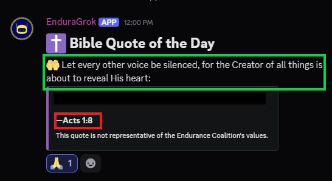

EnduraBot's configuration takes place in 3 files located in `data/`.

- `misc_text.json`
- `permissions.json`
- `variables.json`

`permissions.json` has it's [own page](permissions.md).

## variables.json
The meat and potatoes of the configuration is located at `variables.json`.

`repo`
:   The URL to the bot's GitHub repository. Used by the `/about` command. If you have forked the bot and made changes this should be replaced with *your* repository link.

`version`
:   The current version of the bot represented as a string. Used by `/about`.

`out_of_context_channel_id`
:   The ID of the channel where `/rquote` messages are sourced from.

`alert_channel_id`
:   The ID of the channel where `/alert` messages are sent.

`based_chat_channel_id`
:   The ID of the channel where daily bible quotes will be sent.

`sysop_role_id`
:   The ID of the role that denotes technical staff members of the server. It serves various purposes.

: - Pinged by `/alert`.
: - Used as an exclusion criteria when people ping this role asking for help about a service.
: - Used by `/info` to denote member is a systems operator.

`mod_role_id`
:   The ID of the role that acts as a server moderator. Used by `/info` to denote the member is a staff member.

`admin_role_id`
:   The ID of the role that acts as a server moderator. Used by `/info` to denote the member is a staff member.

`cooldown_exempt_roles`
:   A list of roles that are exempt from the cooldown on `/rquote`.

`edc_links`
:   A list of key value pairs, with the key being a fully justified URL, and the value being a description of what the URL is. Used by `/links`.

`edc_ip`
:   The raw IP address used by game servers hosted by the community. Used by `/ips`.

`edc_url`
:   The URL used by game servers hosted by the community. Used by `/ips`.

`rquote_cooldown_in_minutes`
:   The cooldown time, in minutes, that should take effect once a non-exempt role runs `/rquote`.

`rgit_deals_cooldown_in_seconds`
:   The cooldown time, in seconds, that should take effect once anyone uses `/rgit-deals`.

`bot_insult_chance`
:   The percentage chance the bot has to insult someone when pinged. `0` would make the bot *never* insult someone and `1` would make the bot *always* insult someone.

`bibleq_hour_of_day`
:   The hour of the day, in UTC, that the bible quote should be sent to `based_chat_channel_id`.

`bibleq_minute_of_day`
:   The mintue of the `bibleq_hour_of_day` hour that the bible quote should be sent to `based_chat_channel_id`

`edc_ports`
:   A list of key value pairs, where the key is the fancy name of a game service, and the value is the port needed to connect to it. Used by `/ips`.

`mod_editable_roles`
:   A list of key value pairs, where the key is a human readable version of the role, and the value is the role ID. These roles are ones which `/editrole` will be capable of adding or removing.

`rquote_themes`
:   A list of JSON objects.
: The key is the name of an `/rquote` theme.
: The `title` is the title of the embed of the theme (see green box in above image).
: The `color` is the integer of the color the embed (see embed in above image).
: The `opener_key` should correspond to a JSON object key at `misc_text.json` where it has a value, acting as a JSON list, of potential opener phrases (see red box in above image).

## misc_text.json
Now, let's look at `misc_text.json`.

`bible_gospels`
:   Possible gospels that the daily bible quote task will pick from when it runs (see red box in above image).

`daily_bible_openers`
:   Possible openers the bot will use when the daily bible quote task runs (see green box in above image).

`server_identifiers`
:   This works in conjunction with `issue_identifiers`. The `alert_ping.py` listener will see if at least 1 word in this list *and* 1 word in the `issue_identifiers` list are present in a message where the `sysop_role_id` role is pinged.

`issue_identifiers`
:   This works in conjunction with `server_identifiers`. The `alert_ping.py` listener will see if at least 1 word in this list *and* 1 word in the `server_identifiers` list are present in a message where the `sysop_role_id` role is pinged.

`bot_insults`
:   Possible insults that the bot will use when the `bot_insults.py` listener detects a member pings the bot.

The remaining items should look familiar given they were present in `variables.json`.

The red box in the above image is what `ooc_dating`, `ooc_court`, and `ooc_hr` do.